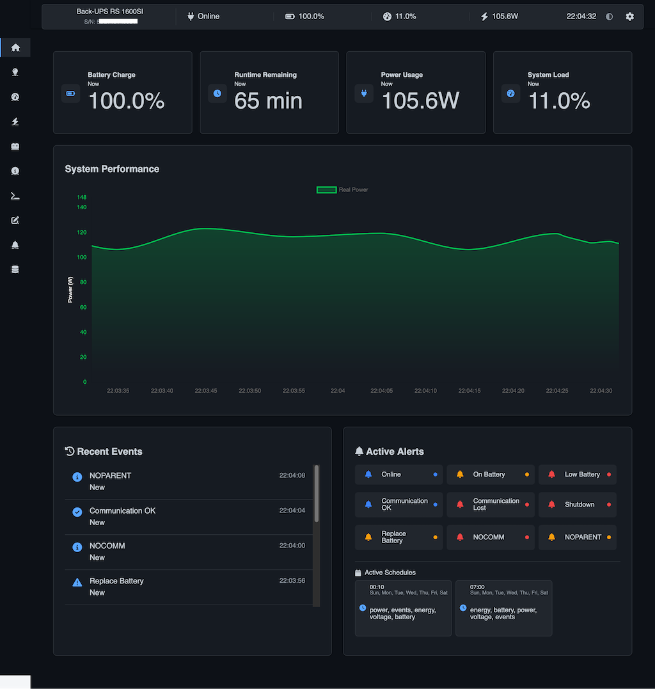
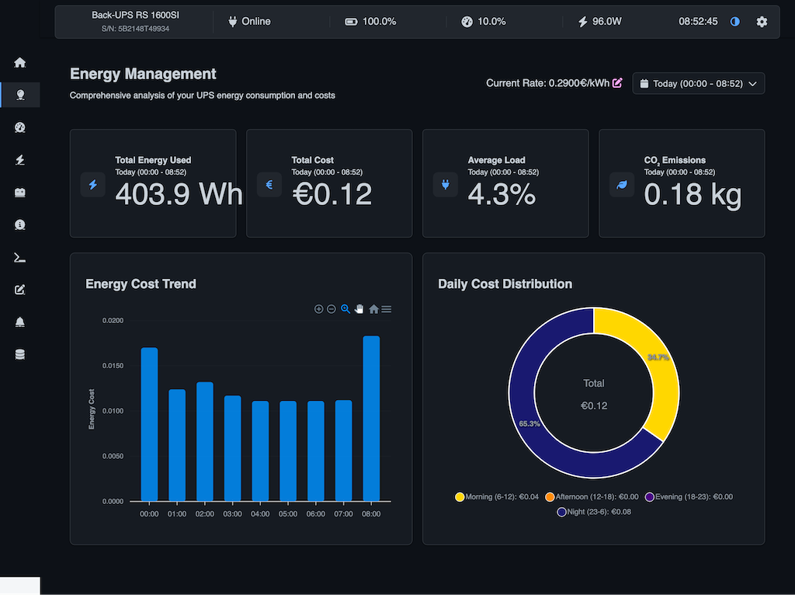
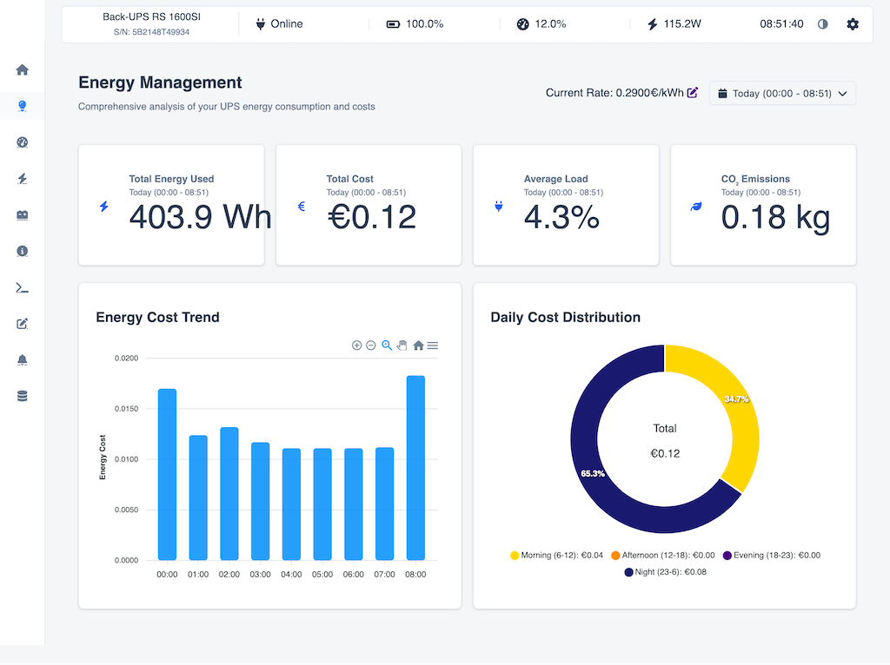

# Nutify - UPS Monitoring System


## Overview

Nutify is a comprehensive monitoring system designed to track the health and performance of your Uninterruptible Power Supply (UPS) devices. It provides real-time insights into critical UPS metrics, allowing you to ensure the continuous operation and protection of your valuable equipment. Nutify collects data, generates detailed reports, and visualizes key parameters through interactive charts, all accessible via a user-friendly web interface.



> **🆕 LATEST DOCKER IMAGES**  
> Use these tags to always get the latest version:  
> • AMD64/x86_64: `dartsteven/nutify:amd64-latest`  
> • ARM64/aarch64: `dartsteven/nutify:arm64-latest`  
> • ARMv7/armhf: `dartsteven/nutify:armv7-latest` (coming soon)

> **📊 Is Nutify working with your UPS?**  
> Please share your experience in the [Discussions](https://github.com/DartSteven/Nutify/discussions) section under "Nutify UPS Compatibility List". Your feedback helps the community!

## Latest Version

**Current Version**: 0.1.3 (10/03/2025)

For a detailed list of changes and improvements, please see the [changelog.txt](changelog.txt) file.

## Key Features

* **Real-time UPS Monitoring:** Continuously collects and displays data from your UPS devices
* **Detailed Reports:** Generates comprehensive reports on UPS performance
* **Interactive Charts:** Visualizes UPS data using interactive charts
* **Customizable Dashboards:** Provides a web-based dashboard to view real-time data
* **Data Persistence:** Stores historical UPS data in a SQLite database
* **Dockerized Deployment:** Easily deployable using Docker and Docker Compose
* **Flexible Deployment Modes:** Run as a complete NUT server or as a lightweight client connecting to a remote NUT server
* **Robust Mode Detection:** Multi-layered CLIENT/SERVER mode detection with automatic fallback mechanisms
* **Energy Monitoring:** Detailed analysis of energy consumption
* **Battery Management:** Monitoring of battery status and performance
* **Event Management:** Logging and notification of UPS events
* **UPS Commands:** Interface to send commands to the UPS
* **Dark/Light Theme:** Customizable interface with both dark and light themes
* **Email Reports:** Automated email reports with detailed UPS status

## Quick Start

To run Nutify using Docker Compose:

<details open>
<summary><b>SERVER Mode (Default)</b> - For direct UPS connection</summary>

Create a `docker-compose.yaml` file with the following content:

```yaml
services:
  nut:
    image: dartsteven/nutify:arm64-latest
    container_name: Nutify-Server
    privileged: true
    cap_add:
      - SYS_ADMIN
      - SYS_RAWIO
      - MKNOD
    devices:
      - /dev/bus/usb:/dev/bus/usb:rwm
    device_cgroup_rules:
      - 'c 189:* rwm'
    environment:
      - NUT_TYPE=SERVER                           # Run full NUT server with drivers (default)
      - SERVER_NAME=UPS
      - SERVER_HOST=0.0.0.0
      - SERVER_PORT=5050
      - TIMEZONE=Europe/Rome
      - ENCRYPTION_KEY=aaaa-bbbb-cccc-dddddddd-eeee-ffff-gggg # REQUIRED: Secret key for data encryption (32+ chars)
      - UPS_NAME=ups
      - UPS_DRIVER=usbhid-ups
      - UPS_PORT=auto
      - UPS_USER=admin
      - UPS_PASSWORD=hunter2
    ports:
      - 3493:3493
      - 5050:5050
    volumes:
      - ./nut_data:/var/run/nut
      - ./nutify/logs:/app/nutify/logs
      - ./nutify/instance:/app/nutify/instance
    restart: always
    user: root
```
</details>

<details>
<summary><b>CLIENT Mode</b> - For connecting to a remote NUT server</summary>

Create a `docker-compose.yaml` file with the following content:

```yaml
services:
  nut:
    image: dartsteven/nutify:arm64-latest
    container_name: Nutify-Client
    environment:
      - NUT_TYPE=CLIENT                           # Connect to remote NUT server
      - SERVER_NAME=UPS-Remote
      - SERVER_HOST=0.0.0.0
      - SERVER_PORT=5050
      - TIMEZONE=Europe/Rome
      - ENCRYPTION_KEY=aaaa-bbbb-cccc-dddddddd-eeee-ffff-gggg # REQUIRED: Secret key for data encryption (32+ chars)
      - UPS_HOST=192.168.1.100                    # IP address of the remote NUT server
      - UPS_NAME=ups                              # Name of the UPS on the remote server
      - UPS_USER=admin                            # Username for NUT authentication
      - UPS_PASSWORD=hunter2                      # Password for NUT authentication
    ports:
      - 5050:5050
    volumes:
      - ./nutify/logs:/app/nutify/logs
      - ./nutify/instance:/app/nutify/instance
    restart: always
```
</details>

After creating your `docker-compose.yaml` file:

1. Start Nutify:
   ```bash
   docker-compose up -d
   ```

2. Access Nutify:
   Open your web browser and navigate to `http://localhost:5050`

## Deployment Modes

Nutify offers two operational modes that you can select using the `NUT_TYPE` environment variable:

### SERVER Mode (Default)

In SERVER mode, Nutify runs a complete Network UPS Tools (NUT) server with local UPS drivers:

```yaml
environment:
  - NUT_TYPE=SERVER                               # Run full NUT server with drivers (default)
  - UPS_DRIVER=usbhid-ups                         # UPS driver (usbhid-ups, nutdrv_qx, etc.)
  - UPS_PORT=auto                                 # Port for UPS connection
```

This mode is ideal when:
- You have a UPS connected directly to the host (via USB, serial, etc.)
- You want to monitor a UPS through SNMP
- You want to share your UPS with other devices on the network

### CLIENT Mode

In CLIENT mode, Nutify connects to a remote NUT server without running local drivers:

```yaml
environment:
  - NUT_TYPE=CLIENT                               # Connect to remote NUT server
  - UPS_HOST=192.168.1.100                        # IP address of the remote NUT server
  - UPS_NAME=ups                                  # Name of the UPS on the remote server
  - UPS_USER=admin                                # Username for NUT authentication
  - UPS_PASSWORD=hunter2                          # Password for NUT authentication
```

This mode is ideal when:
- Your UPS is already connected to another NUT server
- You want to monitor a UPS from multiple locations
- You want a lightweight monitoring dashboard without running UPS drivers

Nutify implements a robust multi-layered detection system for CLIENT mode:
1. Checks the `NUT_TYPE` environment variable
2. Verifies the presence of a flag file
3. Examines the `nut.conf` configuration
4. Automatically skips local driver initialization in CLIENT mode

This ensures reliable operation even in complex network environments.

## Supported Architectures

Nutify is available for multiple hardware platforms:

| Architecture | Docker Image Tag | Devices |
|--------------|------------------|---------|
| 🖥️ **AMD64/x86_64** | `dartsteven/nutify:amd64-latest` | Standard PCs, servers, most cloud VMs |
| 🍓 **ARM64/aarch64** | `dartsteven/nutify:arm64-latest` | Raspberry Pi 4, Pi 400, Compute Module 4, Apple M1/M2 Macs |
| 🍓 **ARMv7/armhf** | `dartsteven/nutify:armv7-latest` | Raspberry Pi 2/3, older ARM-based devices (coming soon) |

You can also use specific version tags (e.g., `dartsteven/nutify:amd64-0.1.3`) if you need a particular version.

## Tested UPS Models

Currently, Nutify has been tested and confirmed working with the following UPS models:

- **Eaton 3S 550**
- **APC Back-UPS RS 1600SI**
- **APC Back-UPS XS 1300G (thanks to yeeahnick)**
- **CyberPower BRG1500AVRLCD (thanks to drewstopherlee)**
- **Back-UPS ES 850G2 (thanks to westridaz)**
- **Smart-UPS 3000 RM (thanks to utlilb)**

While Nutify should work with any UPS device supported by Network UPS Tools (NUT), these specific models have been verified for compatibility and optimal performance.

## Documentation

For detailed documentation, including:
- Complete configuration options
- Advanced features
- Troubleshooting
- Screenshots and examples
- Technical details

Please refer to the [Nutify Wiki](https://github.com/DartSteven/Nutify/wiki).

## License

This project is licensed under the MIT License - see the LICENSE file for details.

## Screenshots

<div style="display: flex; justify-content: space-between;">
  <div style="flex: 1; margin-right: 10px;">
    <p><strong>Dark Theme</strong></p>
    
  </div>
  <div style="flex: 1; margin-left: 10px;">
    <p><strong>Light Theme</strong></p>
    
  </div>
</div>
